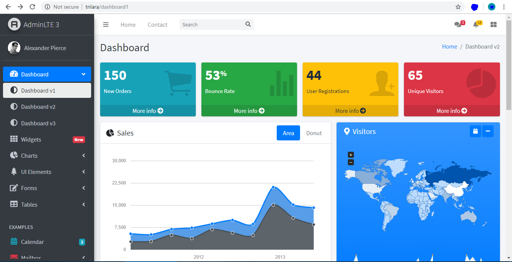

 <h1 align="center"> TriLara</h1> 

|  |  |  |
| :---: | :---: | :---: |

# About TriLara

TriLara is boilerplate for any kind of projects, that you want to start with Latest & up to date
- [Laravel Framework](https://laravel.com/)
- [Bootstrap 4](https://getbootstrap.com/)
- [AdminLTE.io 3](https://adminlte.io/themes/dev/AdminLTE/index.html)

## Todo List / Features

There are lot of features yet to be added.

- [x] FontAwesome 4 ( FontAwesome 5 will be added soon )
- [x] IonIcons 4
- [ ] ckeditor / wysihtml5 editor for BS4
- [ ] Date & Time Range picker
- [ ] many more..

## Yet to Add

...

## License

The TriLara is open-sourced software licensed under the [MIT license](https://opensource.org/licenses/MIT).
